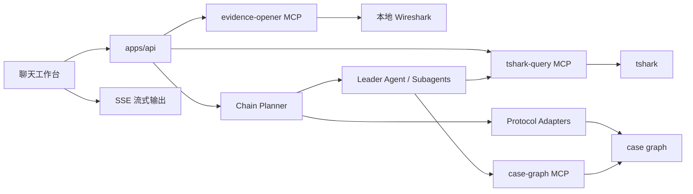

# pcapAI 架构

## 架构概览

pcapAI 是 Agent-first 本地浏览器工作台，用于离线分析网络故障。当前主流程以 `/api/cases/:caseId/agent/stream` 为准：用户上传 pcap 并提问 → Chain Planner 规划分析链 → 确定性 handler / protocol adapter 运行 tshark 产出证据 → 必要时进入 Leader Agent 综合解读证据链 → SSE 输出诊断结论。

Protocol adapter 路由采用三层 fallback：硬编码 regex → 学习到的 pattern → agent（带 tshark-query MCP）。学习到的 pattern 由 LLM 动态生成并持久化到 `data/learned_patterns.json`。



## 三层处理管线

```
用户问题
  ↓
Chain Planner (LLM 或本地兜底)
  ↓ 输出 AnalysisChainPlan (planKind: single | chain)
  ↓
┌─────────────────────────────────────────┐
│ 确定性层 (protocol adapters)             │
│ TCP / DNS / TLS / HTTP / ICMP / UDP     │
│ 三层路由：                               │
│   1. hardcoded regex match              │
│   2. learned patterns (JSON 文件)       │
│   3. agent fallback + 学习              │
│ 直接运行 tshark，产出 evidenceCards     │
│ + checks + protocolCorrelations         │
└─────────────────────────────────────────┘
  ↓ 多步链: executeChain + graph reload
  ↓
┌─────────────────────────────────────────┐
│ 综合解读层 (LLM agent)                   │
│ llm_explain intent → Leader Agent       │
│ 或自动综合 (无 llm_explain 步骤时追加)   │
│ 通过 case-graph MCP 只读 case graph     │
│ 通过 tshark-query MCP 查询原始包数据    │
│ 产出诊断结论 + suggestedQueries         │
└─────────────────────────────────────────┘
```

## 组件

### `apps/api` — Express API + Agent runtime

#### HTTP 层 (`src/http/`)
- **routes.ts** — REST 端点 + SSE 流式 agent 回答。Chain 执行流程：
  1. `planChain()` 规划分析链
  2. `executeChain()` 逐步执行，每步后 `reloadGraph()` 刷新 case graph
  3. 无 `llm_explain` 步骤时自动追加 LLM 综合解读
  4. 新增路由：`GET /api/cases/:caseId/tcp-streams`（TCP 流列表）、`GET /api/cases/:caseId/tcp-streams/:streamIndex/content`（TCP 流内容）
- **caseStore.ts** — case 持久化：`data/cases/:caseId/case.json`
- **capturePreprocess.ts** — 通过 `editcap -s` 裁剪 payload
- **reportBuilder.ts** — 从 case graph 生成结构化 Markdown 报告
- **llmSettings.ts** — LLM 配置文件管理（`.env` 中 `PCAPAI_LLM_PROFILE_*`）

#### Agent 层 (`src/agents/`)
- **runtime.ts** — OpenAI Agents SDK runtime：
  - `runChainPlanner()` — 规划分析链，输出 `AnalysisChainPlan`
  - `runIntentPlanner()` — 单步意图分类，用于普通 `/agent` 路径；无 LLM 时由 `plannerService.ts` 本地兜底
  - `runPcapTroubleshootingAgent()` — Leader Agent + 5 个 handoff subagent：
    - **DiagnosticInterviewAgent** — 诊断访谈，收集故障现象、网络拓扑、抓包位置
    - **HypothesisAgent** — 假设验证，优先读取 insights，再按需调用 tshark-query MCP
    - **PathAgent** — 多节点路径分析和跨链路关联
    - **ProtocolAgent** — 协议级行为分析，可直接调用 tshark-query MCP 查询原始包数据
    - **ReportAgent** — 生成结构化诊断报告
  - 排障 Leader Agent 和 5 个 subagent 同时使用 case-graph MCP 和 tshark-query MCP；Planner Agent 不使用 MCP
  - 返回 `AgentAnswerWithToolCalls`，包含 tool call 名称用于 pattern learning

#### Planner 层 (`src/services/`)
- **plannerService.ts** — 分析链执行引擎：
  - `createPlannerService()` — 工厂函数，接收 12 个 intent handler
  - `planChain()` / `planUserIntent()` — 规划（LLM 或本地兜底）
  - `executeChain()` — 逐步执行，支持 `paramsFrom` 参数绑定 + `reloadGraph` 回调
  - `executeChainStep()` — 单步 intent 路由（12 种 intent）
  - 本地兜底模式：无 LLM key 时使用正则匹配
- **patternLearner.ts** — protocol adapter 自改进模块：
  - `loadLearnedPatterns()` — 从 `data/learned_patterns.json` 加载 learned regex→adapterId 对
  - `learnFromAgentRun()` — agent fallback 后，用 LLM 生成 regex + adapterId；验证后持久化
  - 无硬编码 tool→adapter 映射，LLM 从问题上下文和 adapter 列表决定路由

#### Protocol Adapters (`src/protocolAdapters/`)
6 个确定性 adapter，绕过 LLM 直接运行 tshark：
- **tcp.ts** — RST session pairs、retransmission pairs、zero-window pairs、SYN-no-SYN/ACK、one-way traffic、TCP issues overview
- **dns.ts** — DNS 失败/无响应事务，rcode 分组，多 check 输出
- **tls.ts** — TLS 握手事件（ClientHello/ServerHello/Alert），握手完整性检查，多 check 输出
- **http.ts** — HTTP 事务（4xx/5xx），请求/响应匹配，多 check 输出
- **icmp.ts** — ICMP Unreachable/TTL Exceeded/Fragmentation
- **udp.ts** — UDP 流聚合
- 共享逻辑在 `builders.ts`：packet pair 分组、evidence card 创建、L7→TCP protocol correlations（DNS→TCP、TLS SNI→TCP、HTTP Host→TCP、ICMP→TCP）
- `types.ts` 中 `runProtocolAdapter()` 实现三层路由：hardcoded regex → learned patterns → null（由调用方 fallback 到 agent）

#### Insight Engine (`src/services/insightEngine.ts`)
27 个确定性分析器，在 HTTP 层加载 agent 查询 graph 时懒运行：`loadGraphWithInsights()` 仅在 `graph.packets.length > 0` 且当前 graph 没有 `insights` 时执行，结果写回 case graph。它不在 `runtime.ts` 内部运行，也不会在每次请求都强制重算。无阈值过滤，所有检测到的模式均报告：
- **TCP（12 个）**：连接生命周期、ACK Gap、TCP 时序（RTT/空闲/突发）、窗口趋势、RST 方向、握手重试、延迟 ACK、连接洪泛、段异常、Keepalive、吞吐量、TCP 选项
- **ICMP（2 个）**：Echo 配对（丢包/RTT）、ICMP 高级（Unreachable/PMTU/Traceroute/Redirect）
- **HTTP（4 个）**：状态链（重定向/5xx/4xx）、Header 异常（未匹配/混合端口）、Timing、高级（Host/SNI/错误突发/认证/压缩/Cache-Control/WebSocket/Content-Length/XFF）
- **TLS（2 个）**：握手 Alert、高级（版本/密码套件/证书/会话恢复/ALPN/重协商）
- **DNS（2 个）**：异常（无响应/NXDOMAIN/SERVFAIL/耗时）、高级（突发/成功率/AXFR/截断/TTL/CNAME/Zone Transfer）
- **跨协议**：cross_protocol_chain（DNS→TCP→TLS→HTTP 瀑布图）
- **UDP（1 个）**：多端口/突发/单向流/QUIC 检测
- **新协议**：QUIC（连接概览/握手/版本）、NTP（Stratum/延迟）、SSH（消息分布/断开/认证/版本）

### `apps/web` — React 工作台

单文件 React 19 应用（`src/main.tsx`）。聊天优先布局：
- 会话历史、消息流、底部输入框
- pcap 上传（文件选择 / 拖放 / 粘贴）
- Markdown 渲染（`marked` + `dompurify`）用于已完成的 assistant 消息
- 证据卡片在浏览器新标签页展示（Blob URL，"查看证据详情" 按钮）——聊天气泡保留文字分析，链接页用于 Wireshark 操作
- SSE 流式 agent 回答
- 链式步骤进度（chain_start → step_start → step_done → chain_done）
- TCP stream 查看器（列表→内容下钻，客户端/服务端双列展示）
- 跨协议瀑布图（纯 SVG，DNS/TCP/TLS/HTTP 时序可视化）
- 网络拓扑图（纯 SVG，节点与边）
- Insight 诊断模式渲染
- Mapping hint / time offset hint 编辑
- LLM 设置管理（profile CRUD + 连通性测试）
- 深色/浅色主题切换
- 报告导出

### `packages/shared` — 共享 schema (`@pcapai/shared`)

Zod schema + TypeScript 类型，定义完整领域模型：
- `CaseSpec`, `CaptureNode`, `MappingHint`, `TimeOffsetHint`
- `PacketSummary`（含 QUIC/NTP/SSH 字段）, `Conversation`
- `QueryRun`, `QueryPath`, `EvidenceCard`
- `ProtocolCorrelation`, `AccessCandidateGroup`, `PacketInsight`
- `AnalysisChainPlan`, `AnalysisChainStep`, `ChainStepResult`
- `AgentAnswer`（含 `protocolCorrelations` 字段）, `QueryDiagnosis`
- `CaseGraph` — 聚合所有上述数据

### `config/defaults.json` — 集中配置

所有运行时默认值：API host/port（默认 `30022`）、CORS、MCP 启动命令、LLM 设置（默认 Doubao/ByteDance Ark）、tshark 配置、查询限制、诊断阈值。所有值可通过 `PCAPAI_*` 环境变量覆盖。

### MCP 服务器

三个基于 stdio 的 MCP 服务器（`@modelcontextprotocol/sdk`）：

#### `mcp/tshark-query` — tshark 查询引擎
19 个工具：`build_display_filter`、`get_capture_time_range`、`list_protocols`、`get_network_statistics`、`list_tcp_conversations`、`query_packets`、`get_conversation_packets`、`get_tshark_packet_detail`、`list_tcp_resets`、`list_tcp_retransmissions`、`list_tcp_zero_window`、`list_icmp_events`、`list_dns_packets`、`list_udp_packets`、`list_tls_packets`、`list_http_packets`、`list_tcp_streams`、`follow_tcp_stream`、`get_expert_info`

#### `mcp/evidence-opener` — Wireshark 打开器
用 pcap 路径 + display filter 打开本地 Wireshark。不分析数据包。

#### `mcp/case-graph` — Agent 的 case graph 工具层
20 个工具。大多数工具只读 case graph；`update_network_topology` 会写入本次 Agent runtime 使用的临时 case graph 快照，用于诊断访谈中的拓扑记录，不直接写入持久化 case 文件：
- `load_case_graph` — 读取 case graph 摘要
- `get_case_statistics` — 确定性统计（TCP 通信对、诊断标签、时间范围）
- `get_query_runs` — 读取所有 QueryRun 列表
- `get_query_run` — 按 ID 读取单个 QueryRun
- `get_active_query_run` — 读取当前激活的 QueryRun
- `get_conversation` — 按 ID 读取通讯对
- `get_query_diagnosis` — 读取 selectedDiagnosis（checks、findings、nextSteps）
- `get_path_diagnosis` — 读取 PathHop、PathEdge 和边判断
- `get_protocol_correlations` — 读取 DNS/TLS/HTTP→TCP 关联
- `get_evidence_cards` — 读取证据卡片
- `get_finding` — 按 ID 读取判断结果
- `get_evidence` — 按 ID 读取证据事件
- `get_session_link` — 按 ID 读取跨节点会话关联
- `get_packet_detail` — 按 ID 读取数据包详情
- `explain_path` — 读取当前 QueryRun 通讯路径 hop
- `get_network_topology` — 读取用户提供的网络拓扑和数据路径信息
- `update_network_topology` — 将访谈中提取的拓扑信息写入临时 case graph 快照
- `suggest_next_query` — 基于证据模式返回最多 5 个建议后续查询
- `get_insights` — 读取 Insight Engine 生成的数据包洞察
- `export_report` — 导出 Markdown 报告草稿

## 查询管线

### 流式 Agent 查询（`POST /api/cases/:caseId/agent/stream`）

```
用户问题
  ↓
1. Chain Planner 分类 → AnalysisChainPlan
  ↓
2a. Chain path (planKind=chain):
    executeChain → 逐步执行
    每步后 reloadGraph 刷新 case graph
    支持 paramsFrom 参数绑定
    无 llm_explain 步骤 → 自动追加 LLM 综合解读
  ↓
2b. Single deterministic path:
    protocol adapter 三层路由:
      hardcoded regex match → tshark 查询
      learned pattern match → tshark 查询
      无匹配 → agent fallback (case-graph + tshark-query MCP)
    → evidenceCards + checks + protocolCorrelations
    → 写入 QueryRun
  ↓
2c. Agent path (llm_explain intent):
    Leader Agent → handoff → subagent
    → 通过 case-graph MCP + tshark-query MCP
    → 诊断结论 + suggestedQueries
```

普通 `POST /api/cases/:caseId/agent` 仍保留单步兼容路径：`planUserIntent()` → `executeAgentIntentPlan()` → 必要时 `runPcapTroubleshootingAgent()`。它不完全等同于上面的 Chain Planner 主路径。

### QueryRun 创建（`POST /api/cases/:caseId/query-runs`）

```
1. 推断或接受时间/地址/端口/协议 filter
2. tshark-query MCP → display filter
3. tshark-query MCP → tshark 查询 → conversations + packet evidence
4. API 构建 AccessCandidateGroups + QueryPath + QueryDiagnosis
5. 存储 QueryRun + selectedConversation + path + diagnosis + evidenceCards
6. 浏览器展示证据卡片
```

## Protocol Adapter 自改进

Protocol adapter 路由采用三层 fallback：

1. **Hardcoded regex** — 每个 adapter 有内置的 match 函数
2. **Learned patterns** — `data/learned_patterns.json` 存储 `{regex, adapterId}` 对，由 LLM 在 agent fallback 后生成
3. **Agent fallback** — leader agent 通过 tshark-query MCP 处理查询；成功后 `patternLearner` 用 LLM 生成新 regex pattern

学习模块（`src/services/patternLearner.ts`）无硬编码 tool→adapter 映射。LLM 从问题上下文和可用 adapter 列表决定 regex 和 adapterId。

## 分析链执行

### 12 种 Intent

| Intent | 处理方式 |
|--------|---------|
| `usage_help` | 返回使用帮助 |
| `protocol_statistics` | 确定性统计查询 |
| `network_statistics` | 确定性网络事件查询 |
| `mapping_hint_update` | 更新 mapping hint 并重跑关联 |
| `capture_correlation` | 多文件关联查询 |
| `protocol_event_query` | 协议事件查询（三层路由 + agent fallback） |
| `tcp_session_query` | TCP session 查询 |
| `selected_session_diagnosis` | 当前 session 诊断追问 |
| `active_query_explain` | 当前 QueryRun 解释 |
| `report_request` | 报告生成 |
| `needs_clarification` | 需要更多上下文 |
| `llm_explain` | LLM 综合解读 |

### Graph Reload

链式执行中每步完成后 `reloadGraph()` 刷新 case graph，后续步骤可读到前序步骤写入的 QueryRun。

### 自动综合

当分析链无 `llm_explain` 步骤但配置了 LLM key 时，routes.ts 自动追加 LLM 综合解读：读取所有 QueryRun 的 evidenceCards 和 checks，产出诊断结论。

## 数据持久化

- Case 数据：`data/cases/:caseId/case.json`（JSON 文件）
- 内存缓存：`Map<string, CaseGraph>` 缓存最近加载的 graph
- Agent 临时文件：`PCAPAI_CASE_GRAPH_PATH` 指向的 temp JSON 文件
- LLM profiles：`.env` 中 `PCAPAI_LLM_PROFILE_*` 条目
- Learned patterns：`data/learned_patterns.json`（regex→adapterId 对，由 LLM 生成）

## Agent 边界

Leader Agent 通过 case-graph MCP 读取 case graph，通过 tshark-query MCP 查询原始包数据。Agent 不自行解析 pcap 文件，不执行 shell；真正的 tshark 调用发生在 `tshark-query` MCP 内。`case-graph` MCP 中除 `update_network_topology` 会写临时快照外，其余工具按只读证据访问使用。

如果没有 QueryRun 或没有选中通讯对，Agent 必须追问查询条件，不能给确定断点结论。

综合解读类问题：Agent 必须通过 `get_query_runs` 和 `get_evidence_cards` 读取 QueryRun 里的 evidenceCards、checks 和 protocolCorrelations，不能只看 case graph 顶层 packets/evidence/findings。

## 置信度策略

| 级别 | 含义 |
|------|------|
| `certain` | 确定性管线产出，多个 packet 事实支撑 |
| `high` | 多个事实或明确 mapping hint 支撑，没有明显反证 |
| `low` | 缺少关键上下文或只有单侧证据 |
| `needs_context` | 缺接口方向、节点角色、时间窗口等，不能给确定结论 |

没有证据时不输出确定结论。缺失观察必须标明覆盖范围和前提。

## 当前限制

- 上传 pcap 不全量解析 rawPackets，只有 QueryRun 按 display filter 读取有限样本
- NAT/LB 自动推断暂不强做，先依赖节点顺序和手工线索
- 单 pcap 只返回单节点 hop，不伪造多跳
- Wireshark 采用本地桌面打开方式，不嵌入浏览器
- LLM 综合解读质量取决于模型遵循指令的能力，可能需要迭代调整 agent 指令
- Learned patterns 由 LLM 生成，质量取决于模型 regex 生成能力
- Insight engine 不做阈值过滤，报告量可能较大，需要 UI 侧筛选
