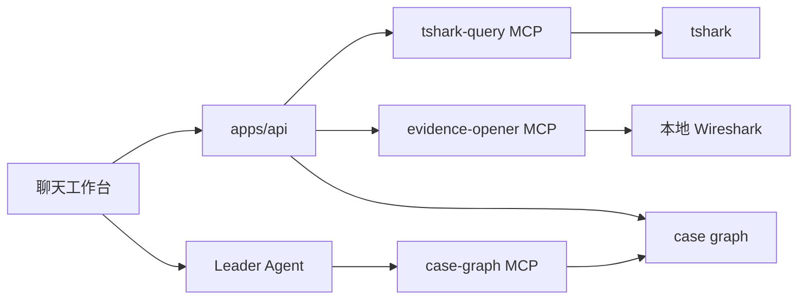

# pcapAI Agent-first QueryRun 架构

## 架构结论

pcapAI 的主语从“全量分析 pcap”进一步改为“Agent 围绕一次访问链路推进排障”。



## 主流程

```text
新建会话
-> 用户在聊天框上传 pcap 并提问
-> 上传阶段只裁剪 payload、登记 capture、读取 capinfos 时间范围和包数
-> Agent 追问缺失的节点/时间/源/目的/端口上下文
-> API 创建 QueryRun
-> tshark-query MCP 生成 display filter 并返回通讯证据
-> 浏览器展示 evidence cards
-> 用户点击 conversation / packet / time range
-> evidence-opener MCP 打开本地 Wireshark
-> Agent 只解释当前 QueryRun 的证据链
```

## 保留组件

- `mcp/tshark-query`：上传阶段读取 capinfos 元信息；查询阶段按时间、地址、端口、协议执行 tshark 查询，返回通讯对、关键包和 packet detail。
- `mcp/evidence-opener`：只负责用 pcap 路径和 display filter 打开本地 Wireshark。
- `mcp/case-graph`：Agent 的只读工具层。
- `apps/api`：QueryRun 编排、case 存储、LLM/Agent runtime。
- `apps/web`：会话历史、聊天上传、证据卡片、上下文抽屉。
- `packages/shared`：共享 schema。

## 删除的旧组件

- `mcp/packet-normalizer`
- `mcp/chain-builder`
- `mcp/diagnosis`
- `mcp/diagnosis-report`
- `mcp/packet-parser`
- `mcp/wireshark-query`

这些组件属于旧的全量扫描路线，容易产出大量统计和标签，但不能稳定回答“这次访问在哪一跳断”。

## Agent 边界

Leader Agent 不直接读 pcap，不执行 shell，不自行拼路径。

Agent 的输入只来自：

- `load_case_graph`
- `get_case_statistics`
- `get_active_query_run`
- `get_query_run`
- `get_conversation`
- `explain_path`
- `get_packet_detail`
- `export_report`

如果没有 QueryRun 或没有选中通讯对，Agent 必须追问查询条件，不能给确定断点结论。

## API 主入口

- `POST /api/cases/:caseId/query-runs`
- `POST /api/cases/new-chat`
- `POST /api/cases/:caseId/attachments`
- `GET /api/cases/:caseId/query-runs/:queryRunId`
- `POST /api/cases/:caseId/query-runs/:queryRunId/conversations/:conversationId/select`
- `POST /api/cases/:caseId/query-runs/:queryRunId/open-wireshark`
- `POST /api/cases/:caseId/evidence/open`

## 当前限制

- 第一版 QueryRun 主要支持 TCP/TLS over TCP。
- 上传 pcap 不再全量解析 `rawPackets`；只有 QueryRun 会按 display filter 读取有限样本。
- NAT/LB 自动推断暂不强做，先依赖节点顺序和手工线索。
- 单 pcap 只返回单节点 hop，不伪造多跳。
- Wireshark 采用本地桌面打开方式，不嵌入浏览器。
