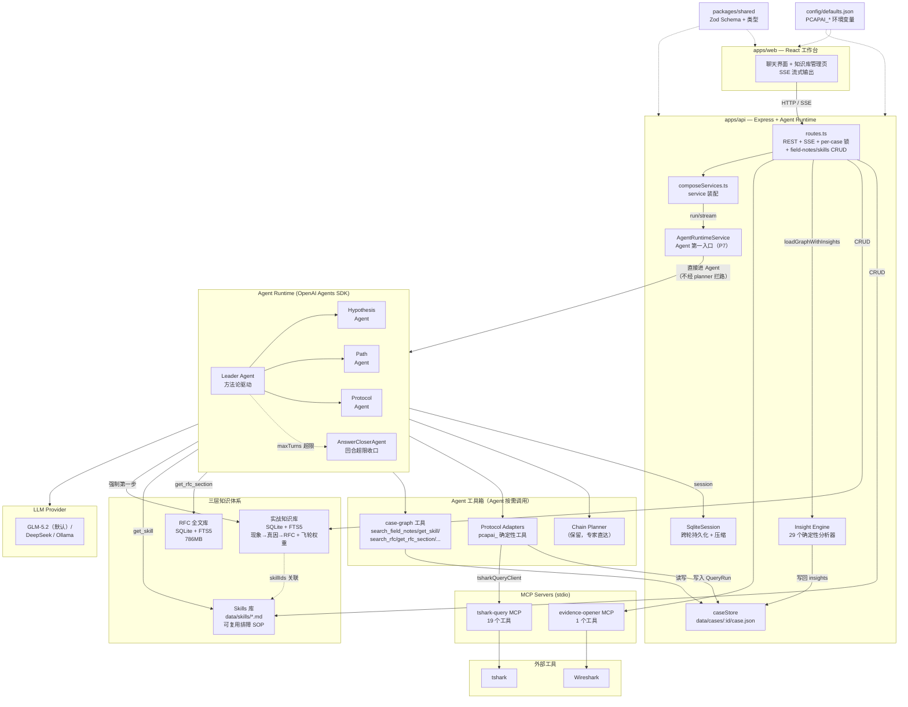

# pcapAI 架构

## 架构概览

pcapAI 是 Agent SDK-first 本地浏览器工作台，用于离线分析网络故障。**Agent 是唯一大脑（第一入口）**，用户上传 pcap 并提问后，直接进入 Leader Agent。Agent 操作**三层知识体系**完成排障：

- **Skills 层（方法论）** `data/skills/*.md` — 可复用排障 SOP，Agent 可用 `create_skill` 自我进化
- **实战知识库（案例）** `data/field-notes/` — 现象→真因→RFC 的沉淀，带飞轮权重（verifiedCount/disputedCount）
- **抓包事实（数据）** tshark-query MCP — 原始包数据

**RFC 是防幻觉边界**：根因结论（rootCauses）要么 `rfcVerified:true`（经 `get_rfc_section` 回读 RFC 原文并引用），要么 `rfcVerified:false`（明确标注"经验推测"）。跨轮上下文由 SDK `Session` 接口（SQLite-backed `SqliteSession`）管理，配应用层压缩。

确定性 protocol adapters（TCP/DNS/TLS/HTTP/ICMP/UDP）和 chain planner **保留为 Agent 工具 / 专家直达通道**，但不再在 Agent 前面拦路。主流程以 `POST /api/cases/:caseId/agent/stream` 为准：用户问题 → AgentRuntimeService → runPcapTroubleshootingAgent → search_field_notes 先验 → tshark 取证 → RFC 验证 → 结构化结论 → SSE 输出。

## 系统架构图



## 请求处理流程

```
用户提问
  ↓
1. loadGraphWithInsights() — 懒运行 Insight Engine（29 个确定性分析器）
   （/agent 和 /agent/stream 端点用 withCaseRunLock 串行化同 case 的并发 agent run）
  ↓
2. routes.ts 只做 HTTP/SSE、profile 激活和参数校验；通过 composeServices() 获取装配好的 service 实例
  ↓
3. AgentRuntimeService **直接进入 Leader Agent**（P7：不再经 chain planner / learned bypass 拦路）
  ↓
4. Leader Agent 按 docs/agent-methodology.md 方法论自主推理：
    第 0 步（强制）：search_field_notes 取实战库先验
      ├─ 命中 → 候选真因 + 关联 skillIds → get_skill 读 SOP → 验证
      └─ 不命中 → 自主推理
    第 1-3 步：tshark 取证 → 跨文件关联 → search_rfc/get_rfc_section 验证
    结论：rootCauses 分层（rfcVerified 或标注推测）
    Agent 按需调用工具箱：pcapai_ 确定性工具 / tshark-query MCP / chain planner（专家直达）
  ↓
5. SSE 流式输出 → Web 聊天气泡；rootCauses 无 RFC 引用的标黄"经验推测"
```

> P7 之前：用户问题 → chain planner（12 intent 拆分）→ adapter 拦路 → agent 兜底。
> P7 之后：用户问题 → **Agent（唯一大脑）** → 三层知识体系。planner/adapter 退化为 Agent 工具，不再拦路。

## 组件详解

### `apps/api` — Express API + Agent Runtime

#### HTTP 层 (`src/http/`)
- **routes.ts** — REST 端点 + SSE 流式 agent 回答。对话入口只负责加载 case、校验请求、激活 LLM profile、写 SSE；`/agent` 和 `/agent/stream` 用 per-case 锁（`withCaseRunLock`）串行化并发 agent run。
- **composeServices.ts** — 服务装配层：组装 13 个 service + 2 个 answer builder + 6 个协议 adapter（TCP 含 7 个子 adapter）。从 routes.ts 抽离，接收 `loadGraph`/`cacheCase`/`agentRuntimeStatus` 共享状态，返回所有 service 实例和 helper（`formatBeijingTime`、`buildAgentQuestion`、`syncMemoryFromQueryRuns`、`updateMemory`）。
- **caseStore.ts** — case 持久化：`data/cases/:caseId/case.json`
- **capturePreprocess.ts** — 通过 `editcap -s` 裁剪 payload
- **reportBuilder.ts** — 从 case graph 生成结构化 Markdown 报告
- **llmSettings.ts** — LLM 配置文件管理（`.env` 中 `PCAPAI_LLM_PROFILE_*`）

#### Agent Runtime Service (`src/services/agentRuntimeService.ts`)
- **AgentRuntimeService** — Web/API 后面的统一对话编排入口。**P7 后 Agent 是第一入口**：`run()`/`stream()` 直接调 `runPcapTroubleshootingAgent`，不再经 chain planner / learned bypass 拦路。planner / adapter / patternLearner 代码保留（专家直达通道 + Agent 工具），只是不再在 Agent 前面拦截。
  1. 调用 `planChain()` 生成单步或多步计划
  2. `planKind=chain` 时调用 `executeChain()`，每步后刷新 case graph
  3. 单步计划调用 `executeAgentIntentPlan()`，由工具层执行 QueryRun、统计、协议 adapter、报告或上下文追问
  4. 工具层无法处理时进入 `runPcapTroubleshootingAgent()`
  5. 统一记录 ToolRun、Agent runtime 状态，并把 QueryRun 结果同步到 case memory
  6. 对 `/agent` 和 `/agent/stream` 使用同一套逻辑，SSE 只影响输出方式

#### Agent Tool Registry (`src/services/agentToolRegistryService.ts`)
- **AgentToolRegistryService** — Agent 和 Planner 共用的确定性工具目录：
  - 统一注册 `list_protocols`、`get_network_statistics`、`create_query_run`、`query_protocol_events`、`diagnose_selected_session`、`correlate_captures`、`export_report` 等工具能力
  - `plannerService` 只产出 intent，不直接持有每个工具实现
  - `plannerService` 通过 registry 执行 intent
  - `AgentRuntimeService` 会把 registry 转成 OpenAI Agents SDK function tools 注入 Leader Agent 和 3 个 subagent
  - SDK tool 名称使用 `pcapai_` 前缀，避免和 `tshark-query MCP` 的底层工具同名冲突
  - 每次 registry 工具执行都会写入 `ToolRun(kind=tool)`；如果工具内部调用 MCP，下层 MCP 仍单独写入 `ToolRun(kind=mcp)`

#### Agent 层 (`src/agents/`)
- **runtime.ts** — OpenAI Agents SDK runtime：
  - `runPcapTroubleshootingAgent()` — Leader Agent + 3 个 handoff subagent（`maxTurns` 可配置，默认 24）：
    - Leader Agent 启动时加载 `docs/agent-methodology.md`（排障方法论）注入 instructions，开发期改文档即可调行为
    - **HypothesisAgent** — 假设验证，优先读取 insights，再按需调用 tshark-query MCP
    - **PathAgent** — 多节点路径分析和跨链路关联
    - **ProtocolAgent** — 协议级行为分析，可直接调用 tshark-query MCP 查询原始包数据
    - Leader 自行处理诊断访谈追问和报告格式化（不 handoff）
  - **AnswerCloserAgent** — 回合预算耗尽时的收口器：无工具，基于已收集的工具结果输出最终结论；自身失败时退化为纯文本（try/catch 兜底）
  - **结论分层 rootCauses**（P6）：每个根因带 `rfcVerified`（经 get_rfc_section 回读 RFC）或明确标注"经验推测"
  - **工具名容错**（P7 后追加）：MiniMax 等模型可能拼错 `pcapai_` 前缀，SDK 抛 "Tool not found" 时带纠正提示最多重试 3 次
  - **SqliteSession**（P5）：实现 SDK `Session` 接口，跨轮持久化到 `data/cases/:id/session-*.db`；应用层压缩（条目超阈值时聚合早期工具调用为摘要，SDK 原生 compaction 依赖 OpenAI Responses API，第三方模型不支持）
  - tshark-query MCP 为常驻单例（`tsharkQueryMcpRuntime.ts`），跨会话复用，connect 带重试
  - **outputSchema 兼容探针**（`outputSchemaProbe.ts`）：检测当前 LLM 是否支持 SDK outputType（structured output），不支持则保留手写 JSON 解析 fallback

#### Planner 层 (`src/services/`)
- **plannerService.ts** — 分析链执行引擎：
  - `createPlannerService()` — 工厂函数，接收统一的 `executeToolIntent`
  - `planChain()` / `planUserIntent()` — 规划（LLM 或本地兜底）
  - `executeChain()` — 逐步执行，支持 `paramsFrom` 参数绑定 + `reloadGraph` 回调
  - `executeChainStep()` — 单步 intent 委托给 AgentToolRegistry
  - 本地兜底模式：无 LLM key 时使用正则匹配
- **protocolEventQueryService.ts** — 协议事件查询编排：
  - 接收 TCP/DNS/TLS/HTTP/ICMP/UDP adapter 列表
  - 负责 adapter 多匹配消歧、learned pattern fallback、agent fallback 和多协议结果合并
  - `routes.ts` 不直接处理协议 adapter 匹配细节
- **queryRunApiService.ts** — QueryRun HTTP 编排：
  - 封装创建 QueryRun、激活 QueryRun、选择 conversation、查询 conversation packets、打开 Wireshark
  - 复用 `queryRunService` 和 `evidenceOpenService`，不新增业务判断
  - `routes.ts` 只负责把 service result 转成 HTTP status 和 JSON
- **patternLearner.ts** — protocol adapter 自改进模块：
  - `loadLearnedPatterns()` — 从 `data/learned_patterns.json` 加载 learned regex→adapterId 对
  - `learnFromAgentRun()` — agent fallback 后，用 LLM 生成 regex + adapterId；验证后持久化
  - 无硬编码 tool→adapter 映射，LLM 从问题上下文和 adapter 列表决定路由

#### 三层知识体系（P1-P4 + P8）

Agent 的核心知识资产，按抽象层级分三层：

- **Skills 层（方法论，`src/services/skillsService.ts`）**
  - 可复用排障 SOP，markdown + frontmatter（name/description/triggers/tools_required）格式，借鉴 Claude skills
  - `list_skills` / `get_skill` / `create_skill` / `delete_skill` 注册为 Agent 工具
  - Agent 用 `create_skill` 自我进化：把验证有效的操作流程固化为新 SOP
  - 种子：`verify-tcp-options`、`analyze-retransmission-pattern`

- **实战知识库（案例，`src/services/fieldNotesService.ts`）**
  - SQLite + FTS5，存"现象→真因→RFC"的沉淀案例
  - `extractPacketFeatures(graph)` 确定性提取抓包特征（observedFlags/missingFlags/analysisFlags），missingFlags 复用 MCP 的 handshakePhase
  - `searchFieldNotes()` 三层检索：协议过滤 → 特征打分（missingFlag×3/analysisFlag×2/observedFlag×1）→ 飞轮权重（verifiedCount 提权/disputedCount 降权）
  - FTS5 question 兜底：特征分=0 时用英文关键词全文检索
  - candidateCause 带 `skillIds` 关联 Skills，命中实战库连带出操作 SOP
  - 飞轮：`verify/dispute/create/delete` API + UI，用户确认驱动权重演进

- **RFC 全文库（规范，`src/services/rfcRagService.ts` + `rfcCorpus.ts`）**
  - 786MB SQLite + FTS5，按章节切分，bm25 排序 + 废弃文档降权
  - `search_rfc` / `get_rfc_section` 注册为 Agent 工具（rfcTools.ts）
  - **防幻觉边界**：根因结论引用 RFC 必须先 get_rfc_section 回读原文，不凭记忆引用

- **索引构建**：`scripts/buildFieldNotesIndex.ts`（实战库）、`scripts/buildRfcIndex.ts`（RFC 库）
- **HTTP API**：`/api/field-notes`（CRUD + verify/dispute）、`/api/skills`（CRUD）、`/api/rag/status`

#### Protocol Adapters (`src/protocolAdapters/`)
6 个确定性 adapter 模块（TCP/DNS/TLS/HTTP/ICMP/UDP），作为 `pcapai_` 工具背后的确定性实现运行 tshark：
- **tcp.ts** — 7 个子 adapter：RST session pairs、retransmission pairs、zero-window pairs、SYN-no-SYN/ACK、one-way traffic、TCP issues overview（RST/重传/零窗口 3 类）、**TCP 连接健康全景**（全量枚举 + 逐条六维健康分类：正常/握手未建立/RST/重传突发/零窗口/单向）
- **dns.ts** — DNS 失败/无响应事务，rcode 分组，多 check 输出
- **tls.ts** — TLS 握手事件（ClientHello/ServerHello/Alert），握手完整性检查，多 check 输出
- **http.ts** — HTTP 事务（4xx/5xx），请求/响应匹配，多 check 输出，跨连接关联
- **icmp.ts** — ICMP Unreachable/TTL Exceeded/Fragmentation
- **udp.ts** — UDP 流聚合
- 共享逻辑在 `builders.ts`：packet pair 分组、evidence card 创建、L7→TCP protocol correlations（DNS→TCP、TLS SNI→TCP、HTTP Host→TCP、ICMP→TCP）以及 HTTP 跨连接关联（`http_to_http`，用于七层代理/SSL 卸载场景）
- `types.ts` 中 `runProtocolAdapter()` 实现分层路由：hardcoded regex → learned patterns → null（由调用方 fallback 到 agent）；`protocolEventQueryService.ts` 的 `adapterIdFromParams()` 优先认 `params.adapterId`（结构化直通 / learned bypass）
- **`conversationHealth.ts`**（`src/services/`）— 纯函数 `classifyConversationHealth`：单条会话六维健康分类（handshake/rst/trafficDirection/retransmission/zeroWindow/closeState），`buildQueryDiagnosis` 和连接健康全景 adapter 共用同一套判定口径

#### Insight Engine (`src/services/insightEngine.ts`)
29 个确定性分析器，在 `routes.ts` 的 `loadGraphWithInsights()` 中懒运行：仅在 `graph.packets.length > 0` 且当前 graph 没有 `insights` 时执行，结果写回 case graph。不在 `runtime.ts` 内部运行，不会在每次请求都强制重算。无阈值过滤，所有检测到的模式均报告：
- **TCP（12 个）**：连接生命周期、ACK Gap、TCP 时序（RTT/空闲/突发）、窗口趋势、RST 方向、握手重试、延迟 ACK、连接洪泛、段异常、Keepalive、吞吐量、TCP 选项
- **ICMP（2 个）**：Echo 配对（丢包/RTT）、ICMP 高级（Unreachable/PMTU/Traceroute/Redirect）
- **HTTP（4 个）**：状态链（重定向/5xx/4xx）、Header 异常（未匹配/混合端口）、Timing、高级（Host/SNI/错误突发/认证/压缩/Cache-Control/WebSocket/Content-Length/XFF）
- **TLS（2 个）**：握手 Alert、高级（版本/密码套件/证书/会话恢复/ALPN/重协商）
- **DNS（2 个）**：异常（无响应/NXDOMAIN/SERVFAIL/耗时）、高级（突发/成功率/AXFR/截断/TTL/CNAME/Zone Transfer）
- **跨协议**：cross_protocol_chain（DNS→TCP→TLS→HTTP 瀑布图）
- **UDP（1 个）**：多端口/突发/单向流/QUIC 检测
- **新协议**：QUIC（连接概览/握手/版本）、NTP（Stratum/延迟）、SSH（消息分布/断开/认证/版本）
- **NAT/L7 代理检测（2 个）**：L7 Proxy Detection（Via/XFF 头检测、SSL 卸载模式、TCP 连接分离）、NAT Heuristic（多目标连接模式、ISN 跳跃、孤立 SYN）

### `apps/web` — React 工作台

单文件 React 19 应用（`src/main.tsx`）。聊天优先布局：
- 会话历史、消息流、底部输入框
- pcap 上传（文件选择 / 拖放 / 粘贴）
- Markdown 渲染（`marked` + `dompurify`）用于已完成的 assistant 消息
- 证据卡片在浏览器新标签页展示（Blob URL，"查看证据详情" 按钮）——聊天气泡保留文字分析，链接页用于 Wireshark 操作
- SSE 流式 agent 回答
- 链式步骤进度（chain_start → step_start → step_done → chain_done）
- TCP stream 查看器（列表→内容下钻，客户端/服务端双列展示）
- 跨协议瀑布图（纯 SVG，DNS/TCP/TLS/HTTP 时序可视化）
- 网络拓扑图（纯 SVG，节点与边）
- Insight 诊断模式渲染
- Mapping hint / time offset hint 编辑
- LLM 设置管理（profile CRUD + 连通性测试）
- 深色/浅色主题切换
- 报告导出

### `packages/shared` — 共享 schema (`@pcapai/shared`)

Zod schema + TypeScript 类型，定义完整领域模型：
- `CaseSpec`, `CaptureNode`, `MappingHint`, `TimeOffsetHint`
- `PacketSummary`（含 QUIC/NTP/SSH 字段）, `Conversation`
- `QueryRun`, `QueryPath`, `EvidenceCard`
- `ProtocolCorrelation`（含 `http_to_http` 跨连接关联类型）, `AccessCandidateGroup`, `PacketInsight`
- `ConnectionLink` — 七层代理/SSL 卸载场景中两条独立 TCP 连接的关联（前端→代理 / 代理→后端）
- `AnalysisChainPlan`, `AnalysisChainStep`, `ChainStepResult`
- `AgentAnswer`（含 `protocolCorrelations` 字段）, `QueryDiagnosis`
- `CaseGraph` — 聚合所有上述数据（含 `connectionLinks`、`insights`）

### `config/defaults.json` — 集中配置

所有运行时默认值：API host/port（默认 `30022`）、CORS、MCP 启动命令、LLM 设置（默认 MiniMax）、tshark 配置、查询限制、诊断阈值。所有值可通过 `PCAPAI_*` 环境变量覆盖。

### MCP 服务器

三个基于 stdio 的 MCP 服务器（`@modelcontextprotocol/sdk`），由 API 和 Agent Runtime 通过 `MCPServerStdio` 连接：

#### `mcp/tshark-query` — tshark 查询引擎（19 个工具）
被两个调用方使用：
- **Packet Analysis Service**（`tsharkQueryClient.ts`）：QueryRun、统计服务和 protocol adapter 调用 tshark 查询
- **Agent Runtime**：Leader Agent 和 subagent 通过 MCP 协议调用，查询原始包数据

工具：`build_display_filter`、`get_capture_time_range`、`list_protocols`、`get_network_statistics`、`list_tcp_conversations`（支持 `limit` 参数，默认 100，连接健康全景 adapter 传 5000 做全量枚举）、`query_packets`、`get_conversation_packets`、`get_tshark_packet_detail`、`list_tcp_resets`、`list_tcp_retransmissions`、`list_tcp_zero_window`、`list_icmp_events`、`list_dns_packets`、`list_udp_packets`、`list_tls_packets`、`list_http_packets`、`list_tcp_streams`、`follow_tcp_stream`、`get_expert_info`

#### `mcp/evidence-opener` — Wireshark 打开器（1 个工具）
仅被 API 层（`evidenceOpenerClient.ts`）调用。用 pcap 路径 + display filter 打开本地 Wireshark。不分析数据包。
- 工具：`open_in_wireshark`

#### `mcp/case-graph` — Agent 的 case graph 工具层（20 个工具）
仅被 Agent Runtime 调用。从临时 JSON 文件（`PCAPAI_CASE_GRAPH_PATH`）读取 case graph。大多数工具只读；`update_network_topology` 写入临时快照，不直接修改持久化文件。

工具：`load_case_graph`、`get_case_statistics`、`get_query_runs`、`get_query_run`、`get_active_query_run`、`get_conversation`、`get_query_diagnosis`、`get_path_diagnosis`、`get_protocol_correlations`、`get_evidence_cards`、`get_finding`、`get_evidence`、`get_session_link`、`get_packet_detail`、`explain_path`、`get_network_topology`、`update_network_topology`、`suggest_next_query`、`get_insights`、`export_report`

## 查询管线

### 流式 Agent 查询（`POST /api/cases/:caseId/agent/stream`）

```
用户问题
  ↓
1. loadGraphWithInsights() — 懒运行 Insight Engine
   （withCaseRunLock 串行化同 case 的并发 agent run）
  ↓
2. routes.ts 进入 AgentRuntimeService
  ↓
2b. learned bypass: 若命中高置信学习模式，跳过 Chain Planner，
    直接执行 { adapterId } 指向的 adapter
  ↓
3. Chain Planner 分类 → AnalysisChainPlan
  ↓
4a. Chain path (planKind=chain):
    executeChain → 逐步执行
    每步后 reloadGraph 刷新 case graph
    支持 paramsFrom 参数绑定
    无 llm_explain 步骤 → 自动追加 LLM 综合解读
  ↓
4b. Single tool path:
    AgentToolRegistry 执行 `pcapai_` 工具
    → protocol adapter 分层路由:
      结构化直通 (params.adapterId) → tshark 查询
      hardcoded regex match → tshark 查询
      learned pattern match → tshark 查询
      无匹配 → agent fallback (case-graph + tshark-query MCP)
    → evidenceCards + checks + protocolCorrelations
    → 写入 QueryRun
  ↓
4c. Agent path (llm_explain intent):
    Leader Agent → handoff → subagent
    → 通过 case-graph MCP + tshark-query MCP
    → 诊断结论 + suggestedQueries
```

普通 `POST /api/cases/:caseId/agent` 与流式接口共用 `AgentRuntimeService`，只是不通过 SSE 输出中间事件。

### QueryRun 创建（`POST /api/cases/:caseId/query-runs`）

```
1. 推断或接受时间/地址/端口/协议 filter
2. tshark-query MCP → display filter
3. tshark-query MCP → tshark 查询 → conversations + packet evidence
4. API 构建 AccessCandidateGroups + QueryPath + QueryDiagnosis
5. 存储 QueryRun + selectedConversation + path + diagnosis + evidenceCards
6. 浏览器展示证据卡片
```

## Protocol Adapter 自改进

Protocol adapter 路由采用分层 fallback：

1. **结构化直通 / learned bypass** — `params.adapterId` 直接路由到目标 adapter，跳过 regex 推断。高置信学习模式（`hitCount >= learnedBypassMinHits`）通过 `tryLearnedBypass` 短路 Chain Planner，直接传 `{ adapterId }` 执行
2. **Hardcoded regex** — 每个 adapter 有内置的 match 函数
3. **Learned patterns** — `data/learned_patterns.json` 存储 `{regex, adapterId}` 对，由 LLM 在 agent fallback 后生成
4. **Agent fallback** — leader agent 通过 tshark-query MCP 处理查询；成功后 `patternLearner` 用 LLM 生成新 regex pattern

学习模块（`src/services/patternLearner.ts`）无硬编码 tool→adapter 映射。LLM 从问题上下文和可用 adapter 列表决定 regex 和 adapterId。

## 分析链执行

### 12 种 Intent

| Intent | 处理方式 |
|--------|---------|
| `usage_help` | 返回使用帮助 |
| `protocol_statistics` | 确定性统计查询 |
| `network_statistics` | 确定性网络事件查询 |
| `mapping_hint_update` | 更新 mapping hint 并重跑关联 |
| `capture_correlation` | 多文件关联查询 |
| `protocol_event_query` | 协议事件查询（分层路由 + agent fallback） |
| `tcp_session_query` | TCP session 查询 |
| `selected_session_diagnosis` | 当前 session 诊断追问 |
| `active_query_explain` | 当前 QueryRun 解释 |
| `report_request` | 报告生成 |
| `needs_clarification` | 需要更多上下文 |
| `llm_explain` | LLM 综合解读 |

### Graph Reload

链式执行中每步完成后 `reloadGraph()` 刷新 case graph，后续步骤可读到前序步骤写入的 QueryRun。

### 自动综合

当分析链无 `llm_explain` 步骤但配置了 LLM key 时，`AgentRuntimeService` 自动追加 LLM 综合解读：读取 QueryRun 的 evidenceCards 和 checks，产出诊断结论。

## 数据持久化

- Case 数据：`data/cases/:caseId/case.json`（JSON 文件）
- 内存缓存：`Map<string, CaseGraph>` 缓存最近加载的 graph
- Agent 临时文件：`PCAPAI_CASE_GRAPH_PATH` 指向的 temp JSON 文件
- LLM profiles：`.env` 中 `PCAPAI_LLM_PROFILE_*` 条目
- Learned patterns：`data/learned_patterns.json`（regex→adapterId 对，由 LLM 生成）

## Agent 边界

Leader Agent 通过 case-graph MCP 读取 case graph，通过 tshark-query MCP 查询原始包数据。Agent 不自行解析 pcap 文件，不执行 shell；真正的 tshark 调用发生在 `tshark-query` MCP 内。`case-graph` MCP 中除 `update_network_topology` 会写临时快照外，其余工具按只读证据访问使用。

如果没有 QueryRun 或没有选中通讯对，Agent 必须追问查询条件，不能给确定断点结论。

综合解读类问题：Agent 必须通过 `get_query_runs` 和 `get_evidence_cards` 读取 QueryRun 里的 evidenceCards、checks 和 protocolCorrelations，不能只看 case graph 顶层 packets/evidence/findings。

## 置信度策略

| 级别 | 含义 |
|------|------|
| `certain` | 确定性管线产出，多个 packet 事实支撑 |
| `high` | 多个事实或明确 mapping hint 支撑，没有明显反证 |
| `low` | 缺少关键上下文或只有单侧证据 |
| `needs_context` | 缺接口方向、节点角色、时间窗口等，不能给确定结论 |

没有证据时不输出确定结论。缺失观察必须标明覆盖范围和前提。

## 当前限制

- 上传 pcap 不全量解析 rawPackets，只有 QueryRun 按 display filter 读取有限样本
- NAT/LB 自动推断依赖启发式检测（TTL 差异、端口模式、ISN 跳跃），不保证覆盖所有场景；MappingHint 仍需手工录入
- L7 代理/SSL 卸载检测基于 HTTP 头（Via/XFF）和连接时序模式，多跳代理链路还原依赖 MappingHint
- 单 pcap 只返回单节点 hop，不伪造多跳
- Wireshark 采用本地桌面打开方式，不嵌入浏览器
- LLM 综合解读质量取决于模型遵循指令的能力，可能需要迭代调整 agent 指令
- Learned patterns 由 LLM 生成，质量取决于模型 regex 生成能力
- Insight engine 不做阈值过滤，报告量可能较大，需要 UI 侧筛选
