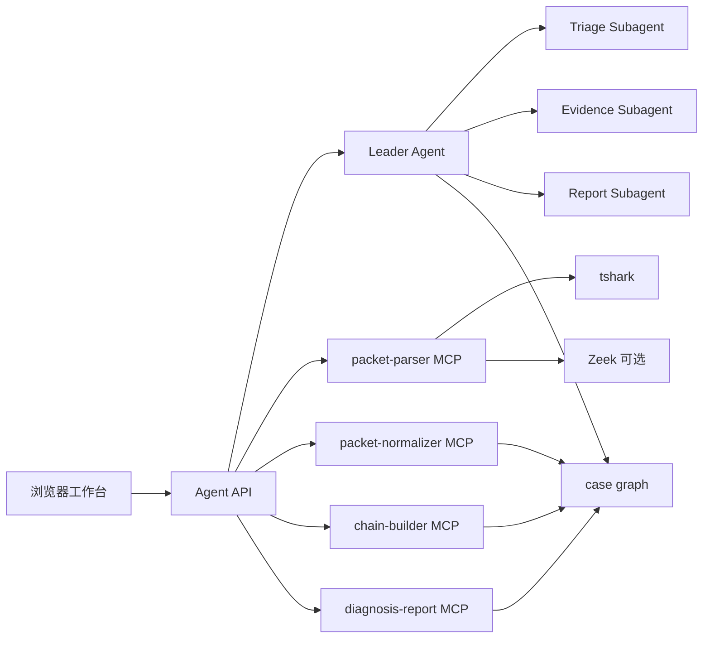
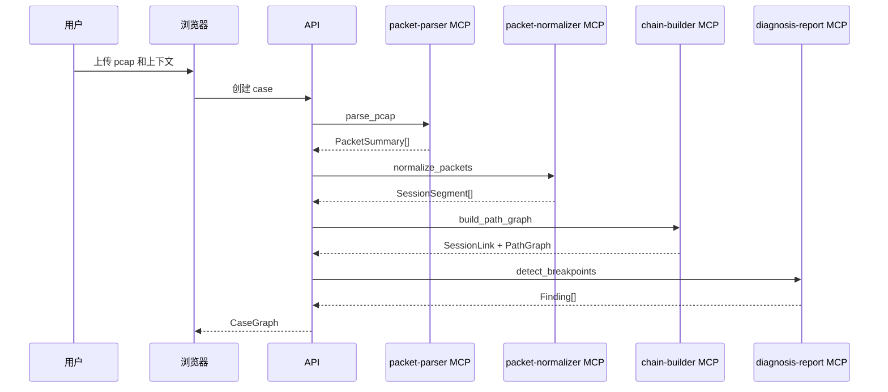
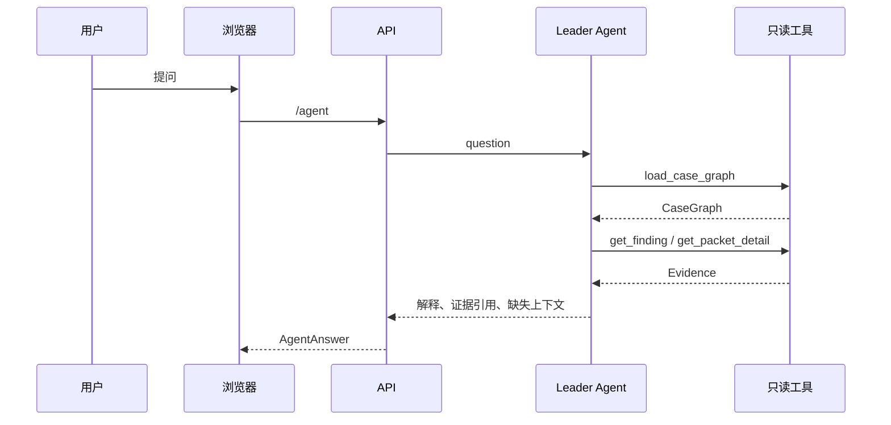

# pcapAI Agent 与 MCP 架构

## 架构结论

pcapAI 采用 `Leader Agent + Subagents + MCP servers + Browser Workbench` 架构。

这个架构的核心边界是：MCP server 做确定性数据处理，Agent 做任务编排和解释，浏览器只展示 case graph 和报告。



## 组件职责

### apps/web

浏览器工作台，负责：

- 创建和查看 case。
- 展示抓包节点、路径图、事件时间线。
- 展示 finding、evidence、packet detail。
- 提供 Agent 问答入口。

前端不解析 pcap，不做诊断判断。

### apps/api

本地 HTTP API，负责：

- 接收上传和 case 上下文。
- 调用 MCP servers 生成 `case graph`。
- 读取和保存 case 数据。
- 承载 OpenAI Agents SDK runtime。
- 向浏览器提供 case graph、packet detail、Agent 问答、报告导出接口。

API 可以启动和连接 MCP server，但不直接实现 packet 解析业务。

### Leader Agent

Leader Agent 是用户问题入口，负责：

- 判断用户是在问路径、证据、finding、报告，还是缺失上下文。
- 调用只读工具读取 `case graph`。
- 必要时 handoff 给 subagent。
- 汇总最终回答。

Leader Agent 不允许：

- 读取原始 pcap。
- 调用 shell。
- 直接运行 `tshark` 或 Zeek。
- 修改 case graph 中的事实。

### Subagents

首版保留三个 subagent：

- `TriageAgent`：判断当前 case 的主要断点和缺失上下文。
- `EvidenceAgent`：解释 finding、evidence、packet/frame 之间的关系。
- `ReportAgent`：把已有 case graph 整理成报告。

Subagent 的输入仍然只能来自工具返回的 `case graph` 或 packet detail。

### MCP servers

MCP server 是确定性工具层。

`packet-parser MCP`：

- 调用 `tshark` 读取 pcap/pcapng。
- 输出 `PacketSummary`。
- 提供 packet detail 查询。
- 后续可接入 Zeek 生成 `conn.log`、`dns.log`、`ssl.log` 摘要。

`packet-normalizer MCP`：

- 把不同来源的 packet 字段规范化。
- 校验 `CaptureNode`、接口方向、时间窗口。
- 输出单节点 `SessionSegment`。

`chain-builder MCP`：

- 用时间窗口、五元组、TCP flags、seq/ack、长度、payload 摘要做跨节点候选匹配。
- 优先应用 `MappingHint` 处理 NAT/SLB/proxy。
- 输出 `SessionLink` 和 `PathGraph`。

`diagnosis-report MCP`：

- 基于 case graph 生成 finding。
- 识别 SYN 缺失、SYN-ACK 缺失、RST、ICMP unreachable、单方向缺包。
- 导出报告。

## 调用链路

### case 生成链路



### Agent 问答链路



## API 边界

首版 API：

- `GET /api/health`：检查 API、`tshark`、Zeek。
- `GET /api/settings/llm`：读取当前 LLM 配置状态，不返回 Key 明文。
- `POST /api/settings/llm`：保存 OpenAI 兼容 base URL、model 和 Key 到本地 `.env`。
- `POST /api/cases`：创建本地 case。
- `POST /api/cases/:caseId/captures`：上传 pcap/pcapng 并记录抓包节点。
- `POST /api/cases/:caseId/analyze`：通过 MCP 解析当前 case 下的抓包文件。
- `POST /api/tools/parse-pcap`：通过 `packet-parser MCP` 调用 `tshark`，输出并保存 `PacketSummary[]`。
- `GET /api/cases/:caseId`：读取 case graph。
- `POST /api/cases/:caseId/agent`：Agent 解释。

后续需要补：

- `GET /api/cases/:caseId/packets/:packetId`：读取 packet detail。
- `POST /api/cases/:caseId/report`：导出报告。

## LLM 配置

Agent runtime 使用 OpenAI Agents SDK 的 `OpenAIProvider`。默认模型和 OpenAI-compatible base URL 放在 `config/defaults.json`，真实 Key 只允许通过环境变量注入。

```bash
export PCAPAI_LLM_API_KEY=...
export PCAPAI_LLM_BASE_URL=https://ark.cn-beijing.volces.com/api/coding/v3
export PCAPAI_LLM_MODEL=doubao-seed-2.0-pro
```

没有 Key 时，`POST /api/cases/:caseId/agent` 返回确定性的 fallback 答复，不调用真实 LLM。

## 部署方式

首版使用 npm 本地部署：

```bash
npm install
npm run dev
```

浏览器访问 Vite 输出的本地地址。默认本地配置在 `config/defaults.json`，运行时可以通过环境变量覆盖。

后续可以加 Docker，但不作为首版阻塞项。Docker 的价值主要是固化 `tshark`、Zeek、Node 版本，降低环境漂移。

## 当前实现状态

已完成：

- npm workspace。
- React 浏览器工作台。
- Express API。
- OpenAI Agents SDK leader/subagent 骨架。
- 四个 MCP server，其中 `packet-parser MCP` 已能通过 `tshark` 解析 pcap。
- 共享 case graph schema。
- 示例 case graph 和只读 Agent 工具。
- API 通过 MCP client 调用 `packet-parser MCP` 并保存 `packets.json`。
- 本地 case 创建、pcap 上传、case analyze。
- LLM base URL、model、API key 配置入口。

未完成：

- packet detail API。
- 多节点 session 匹配真实实现。
- NAT/SLB 映射真实实现。
- 报告导出。

## 下一步实现顺序

1. 前端接入最小 pcap 上传和解析触发。
2. 实现 `packet-normalizer MCP` 的单节点 session segment。
3. 实现 `chain-builder MCP` 的跨节点匹配和 NAT hint。
4. 实现 `diagnosis-report MCP` 的 finding。
5. 前端接入 packet detail、分析状态和证据跳转。
